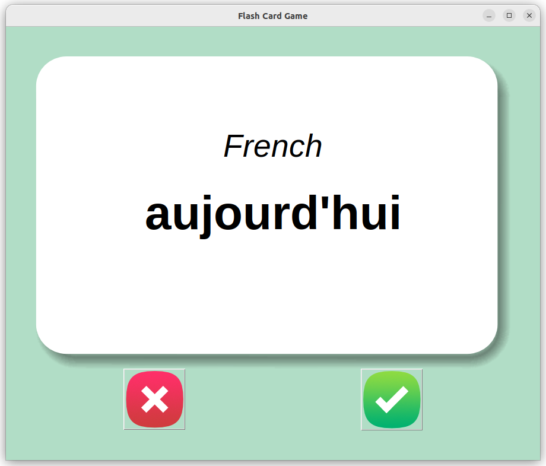
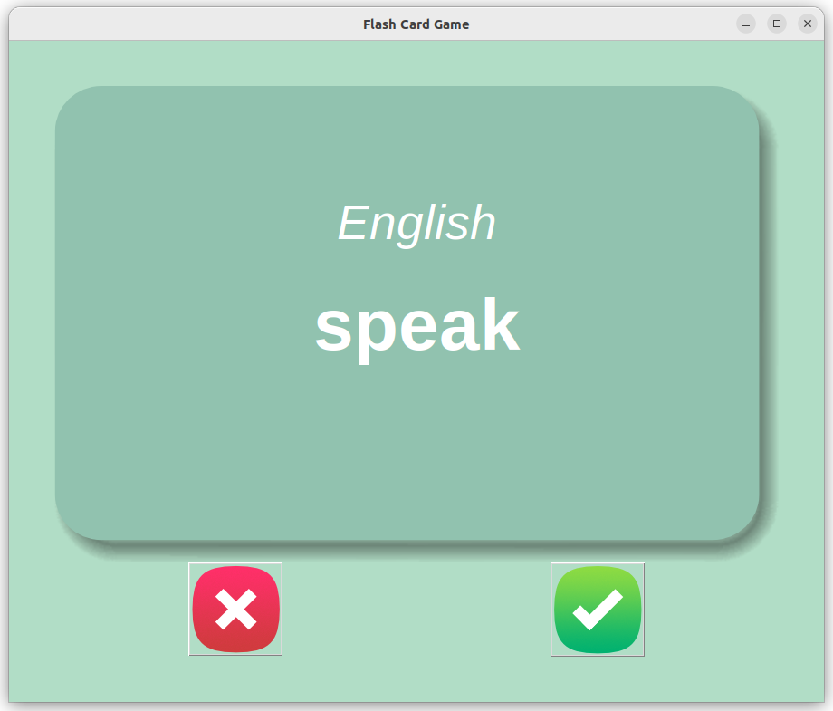

## Flash Card Game

**Flash Card Game** written in Python using the Tkinter and Pandas library.
       
A [Flash Card](https://en.wikipedia.org/wiki/Flashcard) is a card bearing information on both sides, which is intended to be used as an aid in memorization.      
Each flashcard bears a question on one side and an answer on the other.       

       


###### It's a part of the **#100DaysOfCode** challenge by *Angela Yu*. ######    


#### Prerequisites
You will need the following software to run the Flash Card Game:
 - [Python 3](https://www.python.org/downloads/)
 - [pandas](https://pandas.pydata.org/docs/getting_started/install.html#installing-from-pypi)

#### Installation
To get started with the **Flash Card Game**, follow these steps:

1. **Install** pandas
```sh
pip install pandas
```

2. **Clone** the repository:

```sh
git clone https://github.com/resole79/flash_card_game.git
```

3. **Run** the **main.py** file:

```sh
python main.py
```

#### File Structure   
 - **main.py**: Main program.

 

       
       


## **Credit**

Author : Emilio Reforgiato (resole79)

##
<p align="right"><a href="https://www.linkedin.com/in/emilio-reforgiato/" target=”_blank” ></a></p>


